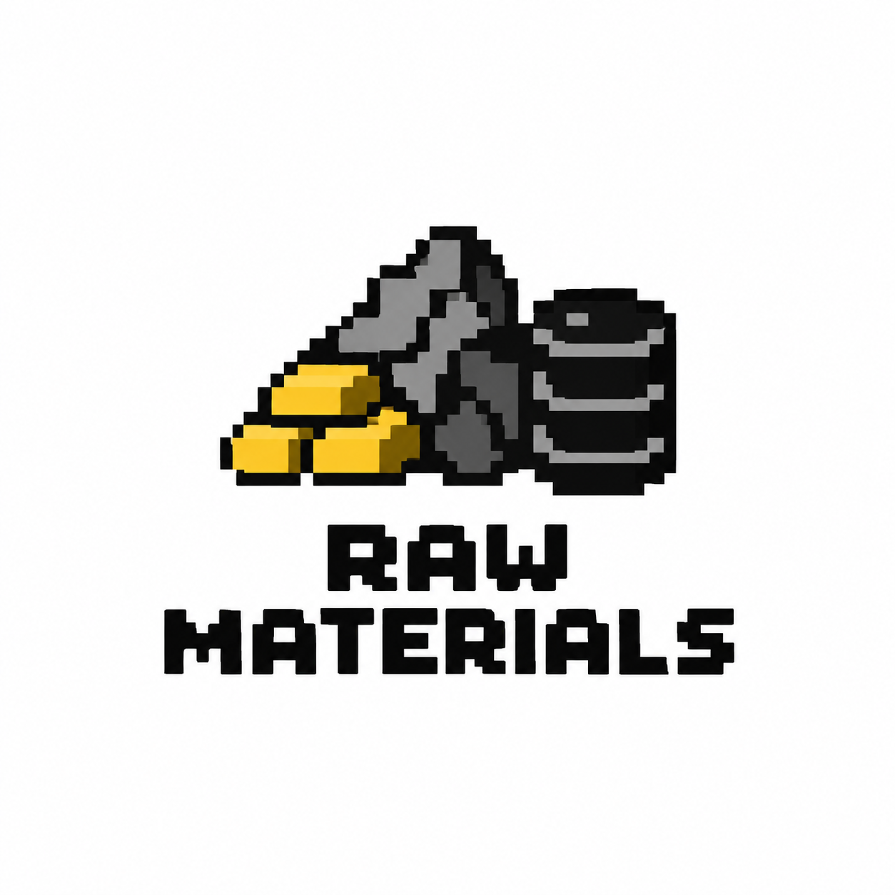

# Raw Materials

Raw Materials is a small, dependency-free Node.js library and CLI for pairing real-world commodities into **memecoin concepts**. It turns inputs such as `toilet paper` + `wood` into deterministic metadata that can be used by a token launcher, community voting tool, or creative naming workflow.

> **Important:** Raw Materials only generates concept metadata. It does not create wallets, deploy smart contracts, sell tokens, handle funds, or provide financial advice. Review applicable laws and obtain professional advice before building anything that involves real money.



## Requirements

- Node.js 20 or newer
- No external runtime dependencies

## Install

Clone the repository, then run:

```bash
npm install
```

The project also includes a Next.js preview scaffold, but the Raw Materials package itself runs directly in Node.js.

## CLI usage

List supported commodities:

```bash
node src/raw-materials.js list
```

Create a pair:

```bash
node src/raw-materials.js pair "toilet paper" wood
```

Example output:

```json
{
  "id": "toilet-paper-wood",
  "name": "Toilet Paper + Wood",
  "ticker": "TPWOOD",
  "commodities": ["toilet-paper", "wood"],
  "categories": ["paper", "timber"],
  "description": "A community-created memecoin concept pairing toilet paper with wood.",
  "disclaimer": "Concept metadata only. This tool does not create, deploy, sell, or promote a financial asset."
}
```

## Use as a library

```js
const { createPair } = require('./src/raw-materials')

const pair = createPair('paper', 'copper', {
  name: 'Paper Hands Copper',
  ticker: 'PHCU',
})

console.log(pair)
```

## Development

Run the built-in tests:

```bash
npm test
```

Supported commodities currently include toilet paper, paper, wood, copper, steel, rubber, cotton, and wheat. Add new entries to the `commodities` array in `src/raw-materials.js` with an id, display name, symbol, category, and aliases.

## License

MIT. See `LICENSE` if included by the repository owner.
